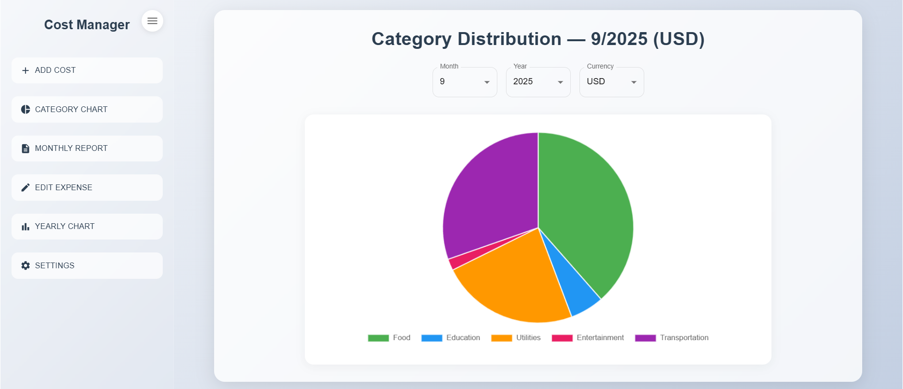
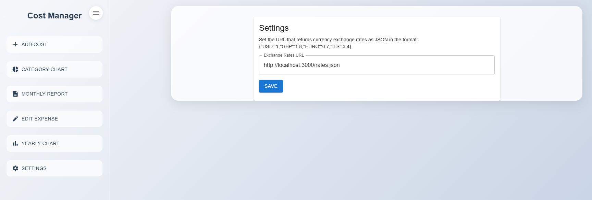

# 📊 Cost Manager – Front-End

A single-page **expense tracker** built with **React** and **MUI**, storing data in the browser via **IndexedDB**.  
Users can add expenses, view monthly detailed reports, and see visual insights with charts.  
The app fetches **exchange rates** from a configurable URL in **Settings**.

> **Main currency:** USD  
> **UI language:** English  

---

## ✨ Features

- **Add Cost** – record amount, currency, category, description (date auto-set to “now”).
- **Monthly Report** – view detailed expenses, totals, filters, and option to show original amounts.
- **Category Chart (Pie)** – see category distribution per month & year.
- **Yearly Chart (Bar)** – track total expenses per month across a year.
- **Currency Switching** – USD / ILS / GBP / EURO (with live conversion via JSON).
- **Settings** – configure **Exchange Rates URL** (saved in `localStorage`).
- **IndexedDB storage** – persistent, client-side database with a custom Promise-based wrapper.
- **Unit Tests** – powered by Jest & Testing Library (mocked IndexedDB and fetch).

---

## 🖼 Screenshots

Screenshots are available under the [`/Screenshots`](./Screenshots) folder.

| Add Cost | Category Chart | Monthly Report |
|----------|----------------|----------------|
|  |  |  |

| Edit Expense | Yearly Chart | Settings |
|--------------|--------------|----------|
|  |  |  |

---

## 🏗 Tech Stack

- **React 18**
- **MUI (Material UI)**
- **Recharts** (charts)
- **IndexedDB** (local database)
- **Jest + Testing Library** (unit tests)
- **Babel & Webpack** (build tools)

---

## 📂 Project Structure

```plaintext
client-side final/
├─ public/
│  ├─ index.html
│  └─ rates.json
├─ src/
│  ├─ components/
│  ├─ services/
│  │  ├─ currencyService.js
│  │  └─ settings.js
│  ├─ tests/
│  ├─ idb.js
│  ├─ app.jsx
│  ├─ index.js
│  └─ setupTests.js
├─ mocks/
├─ Screenshots/
├─ babel.config.js
├─ jest.config.js
├─ webpack.config.js
└─ package.json
```

---

## 🌐 Exchange Rates

Supported currencies: USD, ILS, GBP, EURO  
Rates are stored in `rates.json` and consumed by the app.  
Configurable via **Settings**.

---

## 🗄 Data Storage

Database name: `CostManagerDB`  
Object store: `costs` (indexed by `[year, month]`)  
Dates format: `{ year, month, day } + creation timestamp`  
Persistence: **IndexedDB** + **localStorage** for settings.

---

## ✅ Testing

Bootstrap file: `src/setupTests.js`  
Configured with:
- `@testing-library/jest-dom`
- `fake-indexeddb`
- `whatwg-fetch` (stub for `/rates.json`)
- Minimal `localStorage` mock

Test suites:
- DB behavior: `idb.wrapper.test.js`
- Form flow & validation: `AddCostForm.test.jsx`
- Charts rendering: `YearlyBarChart.test.jsx`
